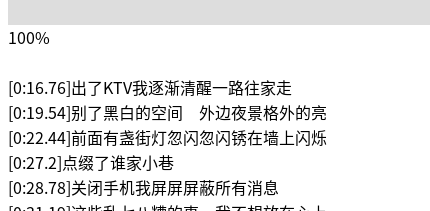

# lrcedit.js
Making LRC file, on your browser, with Javascript.

Visit [Demo](https://outloudvi.github.io/lrcedit.js/index.html) to try making LRC files online!

(The music on the online demo is Josh Woodward's Swansong. Ubuntu users may have came across that song. The melody is full of creativity.)

## How-to?
1. Give your music link to `<audio>`.
2. Give your lyric text to `<script type=plain/text>`
3. Just click +/R to add timestamps. C'mon rhythm!

## What's the buttons?
* Play/Stop
* `<< 2.0s` - 2.0s backwards
* `>> 2.0s` - 2.0s forwards
* `+/R` - Add/replace the timestamp of this line, and go to the next line
* `-` - Remove the timestamp of this line
* `<` - Next line
* `>` - Previous line

## Which is `this line`?
The one with darker background... Or the middle one.

## Preview
While timestamping

Exported

BTW, the song "Black Pineapple" is really great.
